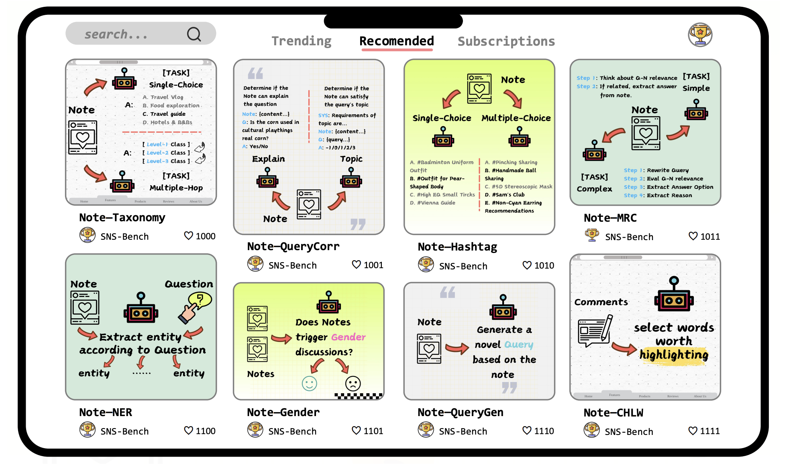

# SNS-Bench: Defining, Building, and Assessing Capabilities of Large Language Models in Social Networking Services



<p align="center">
        🤗 <a href="">Hugging Face</a>&nbsp&nbsp | &nbsp&nbsp🤖 <a href="https://modelscope.cn/datasets/SNS-Bench/sns_bench">ModelScope</a>&nbsp&nbsp | &nbsp&nbsp 📑 <a href="https://openreview.net/pdf?id=sVNNlzjZVN">Paper</a> &nbsp&nbsp | &nbsp&nbsp 🛠️ <a href="https://github.com/HC-Guo/SNS-Bench">Code</a> &nbsp&nbsp 
<br>

## Quick Start

#### 快速安装

评测代码安装依赖可见[Opencompass REAME](./opencompass/README.md)文档。

#### 评测代码

SNS-Bench数据集加载和评测代码位于 `opencompass/opencompass/datasets/sns_bench`目录下，配置文件位于 `opencompass/opencompass/configs/datasets/sns_bench` 。

#### 评测启动

执行下面命令即可

```python
cd SNS-Bench/opencompass
opencompass examples/eval_sns_bench.py
```


## Metrics

> Detailed calculation methods of the metrics are provided in **Section 4.2 of the paper**.
>
> <u>The relevant code is located in the code folder</u>.

我们在论文主表中汇报的指标`reported_score`如下（部分特别说明）：

```python
# Note-CHLW
# code/chlw.py (line 101)
# reported_score = success_f1

# Note-QueryCorr [Topic]
# code/query_corr_topic.py (line 84)
# reported_score = success-macro-f1

# Note-MRC [Simple]
# code/mrc_simple.py (line 174-178)
# reported_score = AVG(success-f1 + success-blue + success-rouge-1 + success-rouge-2 + success-rouge-L)

# Note-MRC [Complex]
# code/mrc_complex.py (line 155-157)
# reported_score = AVG(success-total-f1 + success-option-f1 + success-option-em)
```


# Acknowledge
感谢Opencompass优秀的评测框架


# Dataset License
The dataset is released under the Creative Commons Attribution-NonCommercial-ShareAlike 4.0 International License (CC BY-NC-SA 4.0). This means that the data and models trained using the dataset can be used for non-commercial purposes as long as proper attribution is provided. Commercial use is strictly prohibited without explicit permission from the authors. If the dataset is remixed, adapted, or built upon, the modified dataset must be licensed under identical terms.

[](http://creativecommons.org/licenses/by-nc-sa/4.0/)

The dataset is licensed under a
[Creative Commons Attribution-NonCommercial-ShareAlike 4.0 International License](http://creativecommons.org/licenses/by-nc-sa/4.0/).
